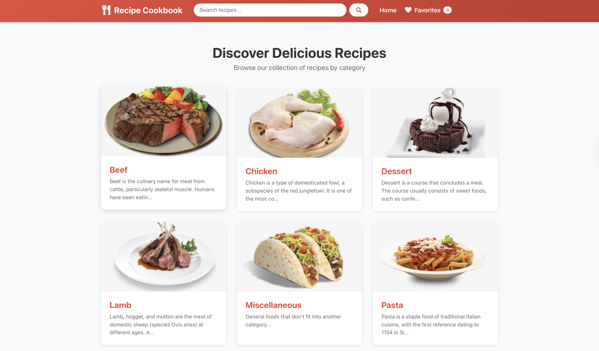

# Recipe Discovery App - React Cookbook

A client-side recipe discovery application built with React, TypeScript, and Vite. This app demonstrates advanced React concepts including custom hooks, Context API for global state management, React Router for navigation, and integration with TheMealDB API.



## Features

### Core Functionality
- Browse recipe categories with images and descriptions
- View recipes by category with complete listings
- Search recipes by name with instant results
- View detailed recipe information including ingredients and instructions
- Save favorite recipes with persistent storage
- Responsive design for mobile and desktop devices

### Technical Highlights
- **Custom Hooks**: `useFetch` and `useLocalStorage` for reusable logic
- **Context API**: Global favorites management with `FavoritesContext`
- **React Router**: Dynamic routing with URL parameters
- **TypeScript**: Full type safety throughout the application
- **Error Handling**: Graceful loading states and error messages
- **Persistence**: Favorites saved to localStorage across sessions

## Installation

### Prerequisites
- Node.js (v16 or higher)
- npm or yarn package manager

### Steps

1. Clone or download the project:
```bash
git clone <repository-url>
cd sba-cookbook
```

2. Install dependencies:
```bash
npm install
```

3. Start the development server:
```bash
npm run dev
```

4. Open your browser and navigate to:
```
http://localhost:5173
```

## Build for Production

To create an optimized production build:

```bash
npm run build
```

The built files will be in the `dist` directory.

## Run Linter

To check code quality:

```bash
npm run lint
```

## Project Structure

```
src/
├── hooks/
│   ├── useFetch.ts              # Generic API fetch hook
│   └── useLocalStorage.ts       # localStorage persistence hook
├── contexts/
│   └── FavoritesContext.tsx     # Global favorites state management
├── components/
│   ├── Navbar.tsx               # Navigation bar with search
│   ├── RecipeCard.tsx           # Reusable recipe card component
│   ├── Spinner.tsx              # Loading spinner component
│   └── ErrorMessage.tsx         # Error display component
├── pages/
│   ├── Home.tsx                 # Categories listing page
│   ├── CategoryPage.tsx         # Recipes by category page
│   ├── RecipeDetailPage.tsx    # Single recipe detail page
│   ├── FavoritesPage.tsx        # User's favorites page
│   └── SearchPage.tsx           # Search results page
├── services/
│   └── api.ts                   # API service functions
├── types/
│   └── index.ts                 # TypeScript type definitions
├── App.tsx                      # Main app component with routing
└── main.tsx                     # Application entry point
```

## Routes

- `/` - Home page displaying all recipe categories
- `/category/:categoryName` - Recipes filtered by selected category
- `/recipe/:recipeId` - Detailed view of a single recipe
- `/favorites` - List of user's favorite recipes
- `/search?query=term` - Search results page

## API Integration

This app uses [TheMealDB API](https://www.themealdb.com/api.php) (free, no API key required).

### Endpoints Used:
- **List Categories**: `/categories.php`
- **Filter by Category**: `/filter.php?c={category}`
- **Recipe Lookup**: `/lookup.php?i={id}`
- **Search by Name**: `/search.php?s={query}`

## Technologies Used

- **React 18** - UI library
- **TypeScript** - Type safety
- **Vite** - Build tool and dev server
- **React Router v6** - Client-side routing
- **React Icons** - Icon library
- **TheMealDB API** - Recipe data source

## Key Implementation Details

### Custom Hooks

#### useFetch Hook
A generic hook for fetching data from APIs with automatic loading and error state management:

```typescript
const { data, loading, error } = useFetch<ResponseType>(url);
```

Features:
- Automatic re-fetching when URL changes
- AbortController for cleanup
- Generic type support
- Loading and error states

#### useLocalStorage Hook
Synchronizes state with browser localStorage for persistence:

```typescript
const [value, setValue] = useLocalStorage<Type>('key', initialValue);
```

Features:
- Lazy initialization from localStorage
- Automatic persistence on changes
- Function updater support (like useState)
- Error handling for storage issues

### Context API - FavoritesContext

Provides global state management for user favorites:

```typescript
const { favorites, addFavorite, removeFavorite, isFavorite } = useFavorites();
```

Features:
- Centralized favorites management
- Automatic localStorage persistence via useLocalStorage hook
- Custom hook for easy consumption
- Type-safe API

### Responsive Design

The app is fully responsive with:
- Grid layouts that adapt to screen size
- Mobile-friendly navigation
- Touch-optimized buttons and cards
- Flexible images that scale appropriately

## Reflection

### Most Challenging Aspect

The most challenging aspect of this project was **implementing the favorites functionality with proper state synchronization**. Specifically:

1. **Data Fetching Challenge**: The TheMealDB API returns minimal data for category/search endpoints (only ID, name, and thumbnail), but the favorites page needs full recipe details. This required:
   - Fetching multiple recipes in parallel using `Promise.all`
   - Handling potential errors for individual recipe fetches
   - Managing loading states during batch fetching
   - Ensuring the UI updates correctly when favorites change

2. **TypeScript Type Safety**: Ensuring type safety while working with the API's dynamic structure was tricky. The recipe detail object has 20 ingredient/measure fields (`strIngredient1` through `strIngredient20`), which required:
   - Creating comprehensive TypeScript interfaces
   - Writing helper functions to extract ingredients dynamically
   - Handling optional/null values properly

The solution involved creating a robust `useEffect` in FavoritesPage that:
- Monitors the favorites array from context
- Fetches full details for each favorite recipe
- Handles loading and error states gracefully
- Re-fetches when favorites change

### Design Decision: Custom Hooks Architecture

**Decision**: Implementing `useFetch` and `useLocalStorage` as generic, reusable hooks rather than page-specific logic.

**Rationale**:
1. **Reusability**: Both hooks are used across multiple components (Home, CategoryPage, RecipeDetailPage, SearchPage all use `useFetch`; FavoritesContext uses `useLocalStorage`)

2. **Separation of Concerns**: By extracting data fetching and storage logic into hooks, components remain focused on presentation and user interaction

3. **Type Safety**: Generic hooks allow type inference at the call site, ensuring type safety without code duplication:
   ```typescript
   useFetch<CategoriesResponse>(url)  // Knows the response type
   ```

4. **Testability**: Isolated hooks are easier to unit test independently of components

5. **Consistency**: All API calls follow the same pattern (loading, error, data states), making the codebase predictable

**Trade-off**: This approach adds an extra layer of abstraction, but the benefits in maintainability and code reuse far outweigh the slight increase in complexity.

## Future Enhancements

Potential improvements for this app:
- Add recipe filtering by ingredients or dietary restrictions
- Implement user authentication for cloud-synced favorites
- Add recipe ratings and reviews
- Create meal planning and shopping list features
- Add offline support with Service Workers
- Implement recipe sharing via social media


## Acknowledgments

- Recipe data provided by [TheMealDB](https://www.themealdb.com/)
- Icons from [React Icons](https://react-icons.github.io/react-icons/)
- Built with [Vite](https://vitejs.dev/) and [React](https://react.dev/)
